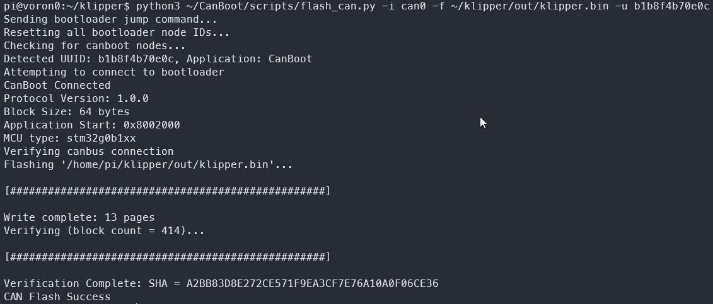

# Update klipper firmware *on* the pi (mcu)

This is useful if you use the pi to handle adxl processing, etc.

1. cd ~/klipper
2. type `make clean`
3. type `make menuconfig`
4. set **microarchitechture** to `Linux process`
5. save and exit
6. Run command below

    ```bash
    sudo service klipper stop
    make flash
    sudo service klipper start
    ```

# Update klipper firmware *from* the pi to mcu (An Octopus 1.1 in this example)

1. Update all software
2. Run these commands and set options per image below (adjust your options for your particular MCU)

    

    ```bash
    cd ~/klipper
    make clean
    make menuconfig
     ```

4. Q and save when prompted
5. Flash with command below (ADJUST YOUR ID ACCORDINGLY. You can get it with **ls /dev/serial/by-id/** command in the shell)

   ```bash
    sudo service klipper stop
    make flash FLASH_DEVICE=/dev/serial/by-id/usb-Klipper_stm32f446xx_310012001550324E31333220-if00
    sudo service klipper start
    ```
7. ???
8. Profit

On restart, klipper should show most current version in Mailsail

# Update klipper firmware via Katapult (formerly CanBOOT) (An EBB36 1.2 in this example)

1. Build firmware per your mcu's requirements

   
   
2. Run the following commands, swapping out your **<your uuid>** as needed

    ```bash
    sudo service klipper stop
    python3 ~/katapult/scripts/flashtool.py -i can0 -u <your uuid> -f ~/klipper/out/klipper.bin
    ```
    
NOTE: If you have a newer install (post late July, 2023), you will most likely have `~/katapult/` vs `~/CanBoot/` directory
    
3. Review the output to make sure everything worked OK! (Your UUID will of course be different)
    
    
   
    
4. Restart klipper
   
    ```bash
    sudo service klipper start
    ```
    
On restart, klipper should show most current version in Mailsail

# Update klipper firmware via Katapult on SKR Pico via UART

To get Katapult on the Pico initially, go here:

https://github.com/Polar-Ted/RP2040Canboot_Install#canboot-for-skr-pico-in-uart-mode

I connected my Pico to a Windows PC and copied the klipper.uf2 file to the drive that popped up in Windows. This flashes Katapult bootloader

1. Build firmware and compile with make -j 4

   

2. Press reset button twice to get into bootloader
3. Run

   ```bash
   sudo service klipper stop
   sudo python3 ~/katapult/scripts/flashtool.py -f ~/klipper/out/klipper.bin -d /dev/ttyAMA0
   ```
4. Restart firmware

